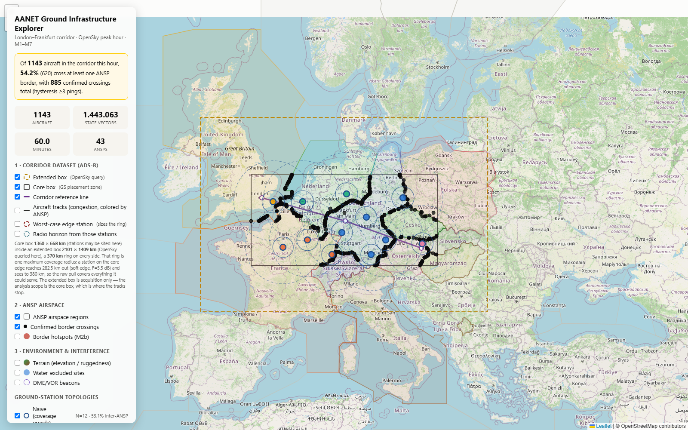
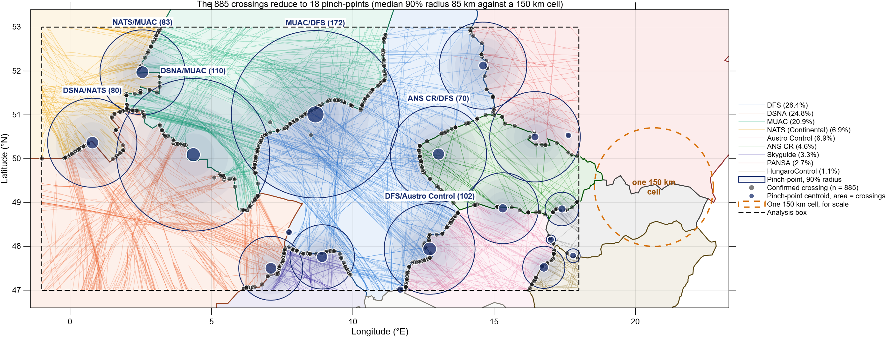
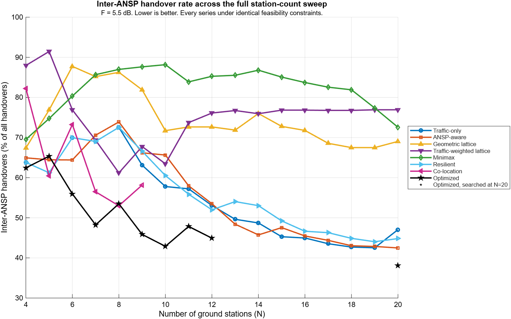
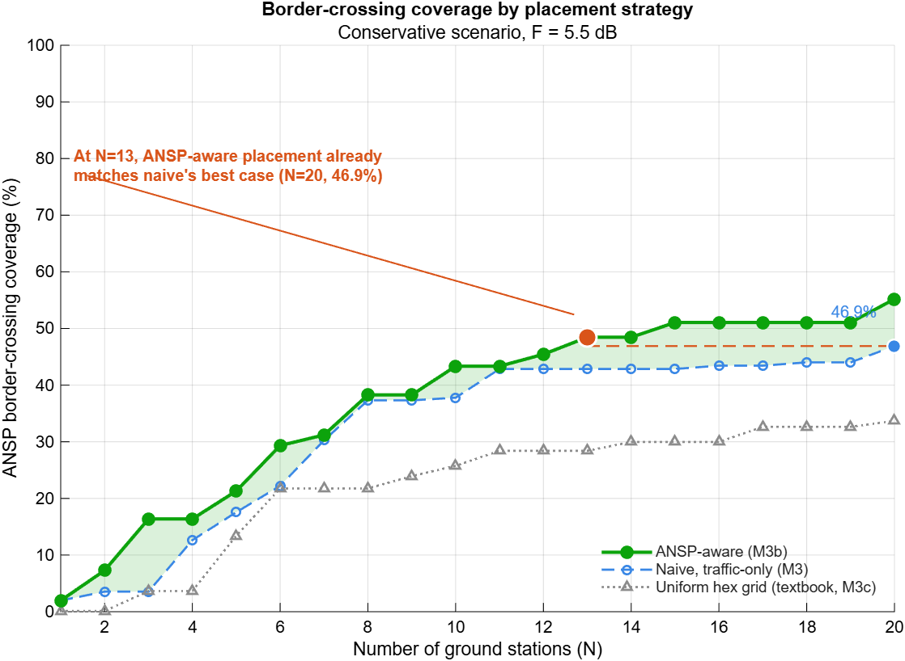
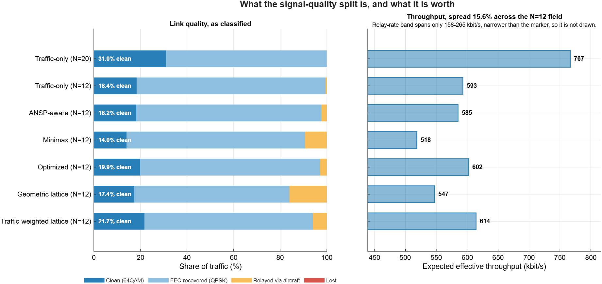

<h1 align="center">Provider-Aware Ground-Station Siting for LDACS / AANET</h1>

<p align="center">
<b>Structural Vulnerability in Aeronautical Ad-hoc Networks:<br>Quantifying and Mitigating Handover Risk Through Resilient Topology Optimization</b><br>
MSc thesis · Mireia Vera Massana · Technical University of Denmark
</p>

<p align="center">


<a href="https://mireiavera8-cmyk.github.io/ansp-aware-aanet/web_visualizer/"></a>
<a href="LICENSE"></a>
</p>

<p align="center">
<a href="https://mireiavera8-cmyk.github.io/ansp-aware-aanet/web_visualizer/"></a><br>
<sub>Interactive explorer of the design hour: 1.4 M ADS-B position reports coloured by controlling ANSP, confirmed provider-boundary crossings, and the compared ground-station layouts. <a href="#interactive-visualizer">How to open it →</a></sub>
</p>

---

## The problem in one paragraph

In the three-tier AANET architecture every air-to-air path ends at an LDACS ground station, and where those stations are built has been decided by coverage, cost, spectrum compatibility with DME and worst-served distance. **No published siting method asks who operates the station**, although the standards make ownership decisive: a seamless make-before-break handover is only available between stations of the same provider, and European airspace is split among more than thirty ANSPs whose borders follow states, not traffic. A network can meet every published criterion and still lay an administrative seam across the busiest corridor in Europe. This repository measures that seam with recorded traffic and tests what siting can and cannot do about it.

## Key results

Nine siting strategies (eight hand-designed, one found by a seeded randomized search) are compared at matched station count on one hour of recorded traffic, then re-scored on an independent hour the pipeline never saw. No synthetic mobility is used anywhere.

| Finding | Number |
|---|---|
| Aircraft crossing at least one provider boundary in the design hour | **54.2 %** |
| Handovers landing on another operator's station, 12-station coverage-driven network | **53.5 %** |
| Floor of that share across every hand-designed strategy and every N from 4 to 20 | **42.48 %** |
| Same share for the searched placement (N = 12 / N = 20) | **44.93 % / 38.07 %** |
| Throughput cost of siting on provider boundaries, worst case over the link-budget sweep | **≤ 2.69 %** |
| Failure exposure neutralised by four inter-provider interconnection agreements | **77.9 %** |

The provider-aware strategy is the only one of the nine that *improves* on the out-of-sample hour, where the coverage-driven baseline degrades by about seven points. Boundaries do not move; traffic does.

<table>
<tr>
<td width="50%"><br><sub><b>Where the seam is.</b> Eighteen border pinch-points on top of every confirmed crossing in the design hour.</sub></td>
<td width="50%"><br><sub><b>The floor.</b> Inter-provider handover share for every strategy at every N = 4…20 under identical buildability constraints.</sub></td>
</tr>
<tr>
<td><br><sub><b>Provider-aware vs. baselines.</b> Pinch-point coverage per station count.</sub></td>
<td><br><sub><b>What it costs at the physical layer.</b> Clean / FEC / relay / lost split and the resulting throughput band.</sub></td>
</tr>
</table>

## Pipeline

```
main.m
 ├─ M1  data          load OpenSky CSV, filter to the corridor box, tag every point with its ANSP (2-D footprint, AIRAC 490)
 ├─ M2  borders       hysteresis-confirmed provider crossings · M2b pinch-points + MUAC control group · M2c DME beacon reach
 ├─ M3  topology      nine siting strategies on one demand grid, all under water / terrain / DME / spectrum constraints
 │                    traffic-only · provider-aware · geometric hex · weighted hex · co-location · Pareto sweep · minimax · resilient · searched
 ├─ M7  link          CINR link budget (DME interference, fade, airframe, ITU-R P.676) → clean / FEC / relay / lost · throughput band · sensitivity · post-failure link
 ├─ M4  handover      share of handovers that cross a provider boundary, per topology
 ├─ M5  failure       leave-one-out station failure: who inherits the traffic, and is it the same provider?
 ├─ M6  repair        reactive same-ANSP backup · M6c minimax backup search · M6b interconnection policy scenario
 └─ M8/M9 sweep       every topology at every N = 4…20, then the single-provider-station mechanism behind the non-monotonic curves
```

| Folder | Contents |
|---|---|
| `config/` | `setup_config.m`, the single source of every parameter (with rationale in `docs/design_considerations.md`) |
| `src/common/` | shared geometry, coverage, siting-constraint and hysteresis helpers used by every module |
| `src/data` `borders` `topology` `handover` `link` `sweep` | the modules above, one file per module |
| `src/search/` | seeded p-robust GRASP search for the *Optimized* topology and its selection-rule / placement-robustness checks |
| `src/plots/` | one plotting function per figure family |
| `validation/` | out-of-sample re-scoring on the second traffic hour |
| `tests/` | `regression_check.m`: re-runs the deterministic modules and compares against the committed results |
| `results/` | committed checkpoints (`*.mat`) and the thesis figures |
| `web_visualizer/` | self-contained Leaflet explorer (`index.html` + `data/viz_data.js`) |

## Reproduce

Everything downstream of M1 runs from the committed checkpoints; the raw OpenSky CSVs (0.5–1 GB, see [`data/README.md`](data/README.md)) are only needed to rebuild `results/tagged_data.mat`.

```matlab
% figures used in the thesis, rebuilt from results/*.mat (about 1 min)
make_figures

% confirm that every figure in a LaTeX tree has a generator here
make_figures('check', '../MSc_MireiaVera_overleaf')

% numerical regression of the M2, M3, M4, M5 and M7 modules against the committed results (about 10 min)
regression_check

% the searched topology (run once; main.m loads the winner)      the full pipeline (needs the CSV; hours)
search_optimized_topology                                          main
```

Two disclosed uncertainties are carried as bands rather than point values throughout: the fade margin (2.6 / 5.5 dB, `by_margin(1)` / `by_margin(2)`, the latter being the headline) and the LDACS decode threshold (3.2 / 6.0 dB). Parameters with no published calibration for a deployed LDACS network are swept in M7c rather than defended.

## Interactive visualizer

`web_visualizer/index.html` is a single-page Leaflet map of the design hour: ADS-B tracks coloured by the ANSP controlling each stretch, hysteresis-confirmed crossings, the eighteen pinch-points, terrain and water-excluded sites, DME/VOR beacons, and the four compared 12-station topologies with their soft-edge coverage rings and inter-provider handover share.

- **Online:** <https://mireiavera8-cmyk.github.io/ansp-aware-aanet/web_visualizer/>
- **Locally:** open `web_visualizer/index.html` in a browser (no server needed; map tiles need internet).
- **Rebuild the data file** after a pipeline run: `run('web_visualizer/prepare_web_data.m')`.

## Data and provenance

Recorded inputs only: OpenSky Network ADS-B state vectors (design hour 2023-05-15 08:00–09:00 UTC, validation hour 2023-05-18 17:00–18:00 UTC), EUROCONTROL ANSP airspace polygons (AIRAC 490), Copernicus GLO-90 terrain via Open-Meteo, and a register of ten major-airport DME/VOR beacons. The analysis box is 47–53 °N, 1 °W–18 °E; the OpenSky query box is that box grown by the 370 km radio-horizon reach on every side.

## License

Code is released under the [MIT License](LICENSE). Third-party data in `data/` and `results/` keeps its own terms (EUROCONTROL, Copernicus/ESA, OpenSky Network research use); the raw ADS-B state vectors are not redistributed.

## Citation

```bibtex
@mastersthesis{VeraMassana2026,
  author = {Vera Massana, Mireia},
  title  = {Structural Vulnerability in Aeronautical Ad-hoc Networks: Quantifying and Mitigating
            Handover Risk Through Resilient Topology Optimization},
  school = {Technical University of Denmark},
  year   = {2026}
}
```
